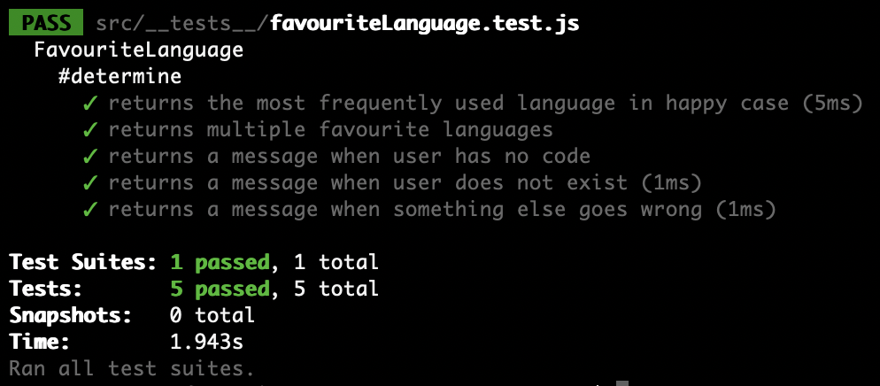

# Favourite Language

A little website which makes a guess of a user's favourite language using the GitHub API.

## How to Run

1. [Hosted online](http://inconclusive-income.surge.sh/), alternatively:
2. Clone this repository
3. Install [node.js](https://nodejs.org/en/) and run `npm install` in the command line to install dependencies
4. Open index.html
5. To run test, enter `npm test` from the root directory

## Approach

- MVC architecture (src/favouriteLanguage.js, index.html, interface.js)
- Tried to follow OOP principles as much as possible
- TDD -> red, green, refactor
- Refactored at other stages when I felt it was appropriate

## Thoughts/ Next Steps

- I feel there are opportunities to refactor src/favouriteLanguage.js. Not 100% on the use of constants here nor how verbose the calculateMostFrequentLanguages method is.
- I noticed a missed edge case in the tests. Where the majority of a user's repositories are empty but a minority aren't (e.g. 3 empty repos, 1 with JavaScript -> my code would return null). It would be nice to fix this, but I ran out of time this weekend
- I tried getting a more accurate picture of the user's favourite language with commit count/ number of bytes of each language. Quickly hit the API rate limit in this way though, so would require authentication
- Not 100% sure if looping tests is good practice. I went with it as the alternative was much, much longer!
- Could use some kind of framework here (React) instead of the current very simple frontend.
